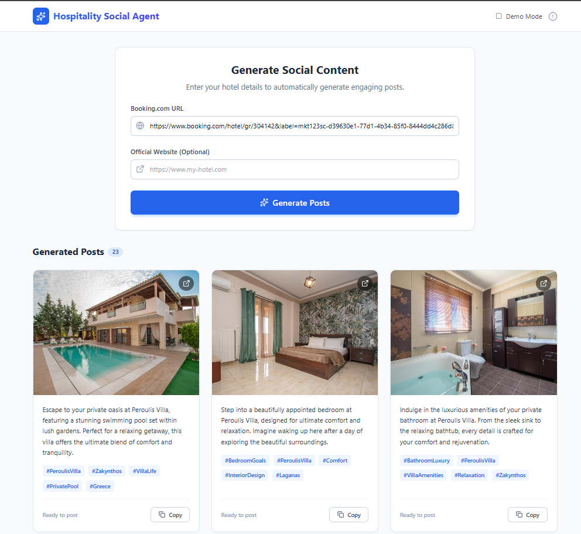

# Hospitality Social Media Agent (Capstone Project)

<p align="center">
  
</p>

Track: **Concierge Agents** – AI agents for hospitality and customer experience.  
Course: **5‑Day AI Agents Intensive with Google (Nov 10–14, 2025)** – Capstone project.

Multi‑agent pipeline that turns a hotel’s Booking.com listing (plus optional website) into ready‑to‑publish social posts with image‑aware captions and hashtags. The project is fully wired end‑to‑end: multi‑agent backend on Cloud Run + React frontend.

---

## 1. The Pitch – Problem, Solution, Value (Category 1)

### 1.1 Problem
- Hotels struggle to produce a steady stream of fresh, on‑brand social content across channels.
- Marketing teams manually scan Booking.com listings, hotel sites, and photo galleries, then write posts from scratch – this is slow and doesn’t scale.
- Captions are often generic and not tied to what’s actually in the images (e.g., generic “cozy room” copy for a photo with a pool view), which reduces engagement.

### 1.2 Solution
- An **agentic social media content factory for hospitality**:
  - Input: a Booking.com hotel URL (plus optional official website URL).
  - Agents scrape structured text and images, enrich context from the hotel’s own site, analyze each image using Vision, and then generate tailored captions and hashtags per image.
  - Output: a ready‑to‑use JSON list of posts that a marketing team or frontend app can publish directly to Instagram, Facebook, etc.

### 1.3 Value & Core Concept
- **Core concept:** a multi‑agent, tool‑using pipeline where each agent specializes in one part of the job (scraping, enrichment, image analysis, copywriting) and passes structured state to the next.
- **Value for hospitality teams:**
  - 10x faster content creation for social platforms.
  - Better visual storytelling because captions are grounded in what is actually in each image.
  - Consistent tone of voice, anchored in Booking.com descriptions and website content.
- Agents are the core of the solution, not a thin wrapper around a single prompt: each agent has a clear role, toolset, and state responsibilities.

---

## 2. Architecture & Agents (Category 2 – Implementation)

### 2.1 High‑Level Architecture
- **Root App (`social_media_app` in `main.py` + `main_agent/agent.py`)**
  - Uses `google.adk.apps.App` with a custom `SequentialAgent` subclass (`SocialMediaPipeline`) as the root agent.
  - Orchestrates the full pipeline as a sequence of sub‑agents.

- **Session & State Layer**
  - Primary: `DatabaseSessionService` (SQLite via SQLAlchemy) for persistent sessions and events.
  - Fallback: `InMemorySessionService` if DB initialization fails (e.g., in constrained environments).
  - `EventsCompactionConfig` configured to compact events for long‑running sessions.

- **Execution Layer**
  - `google.adk.runners.Runner` drives the root agent and streams events.
  - OpenTelemetry tracing wraps the pipeline (`run_pipeline` span).

- **API Layer (`server.py`)**
  - FastAPI app exposing:
    - `GET /` – health check.
    - `POST /generate` – main endpoint that triggers `run_pipeline` and returns the list of posts.
  - CORS configured to allow the local Vite frontend (`http://localhost:5173`).

- **Frontend (`frontend/`)**
  - Vite + React + Tailwind app for marketers.
  - Calls the backend `/generate` endpoint, then renders a grid of image cards with captions, hashtags, and copy‑to‑clipboard actions.

### 2.2 Agents and Tools

**Root Pipeline (`main_agent/agent.py`)**

- `SocialMediaPipeline` (subclass of `SequentialAgent`) with sub‑agents:
  1. `Booking_Scraper_Agent` (`main_agent/subagents/booking_scraper_agent/agent.py`)
  2. `Website_Scraper_Agent` (`main_agent/subagents/website_scraper_agent/agent.py`)
  3. `Image_Analysis_Agent` (`main_agent/subagents/image_analysis_agent/agent.py`)
  4. `Social_Media_Agent` (`main_agent/subagents/social_media_agent/agent.py`)

**Sub‑Agents**

- **Booking_Scraper_Agent**
  - Type: `LlmAgent` using Gemini `gemini-2.5-flash-lite`.
  - Tool: `get_booking_com_data` from `main_agent/tools/tools.py`.
  - Behavior: delegates scraping to a Playwright‑based script (`booking_playwright_scraper.py`) to extract:
    - Hotel name, description, canonical URL, and image URLs.
  - Output state key: `booking_data`.

- **Website_Scraper_Agent**
  - Type: `LlmAgent` with Gemini.
  - Tool: `google_search` (built‑in ADK tool).
  - Behavior: uses search queries against the hotel domain (e.g., `site:hotel.com amenities`, `site:hotel.com "about us"`) to pull amenities and brand copy.
  - Output state key: `website_data`.

- **Image_Analysis_Agent**
  - Type: `LlmAgent` with Gemini.
  - Tool: `analyze_image_with_vision` from `main_agent/tools/tools.py`.
  - Behavior:
    - Iterates over `booking_data.image_urls`.
    - Calls Google Cloud Vision for each URL to get labels, objects, and text.
    - Constructs a list of `{image_url, tags}` objects.
  - Output state key: `analyzed_images`.

- **Social_Media_Agent**
  - Type: `LlmAgent` with Gemini.
  - Inputs from state: `booking_data.description` and `analyzed_images`.
  - Behavior (per image):
    - Generates a 2–3 sentence caption grounded in the image tags and hotel description.
    - Generates 3–5 hashtags per image.
  - Output state key: `final_posts` (list of `{image_url, caption, hashtags}`).

---

## 3. Technical Implementation & Key Concepts (Category 2 – Features)

This project applies several of the key concepts listed in the Capstone “Features To Include In Your Agent Submission” section:

1. **Multi‑agent system (Sequential agents powered by LLMs)**  
   - Root `SocialMediaPipeline` uses `SequentialAgent` to chain four LLM‑backed agents.
   - Each agent reads and writes structured state, enabling a clean hand‑off between steps.

2. **Tools (custom tools + built‑in tools)**  
   - Custom tool `get_booking_com_data` wraps a Playwright scraper script (`booking_playwright_scraper.py`) in a subprocess for Booking.com HTML extraction.
   - Custom tool `analyze_image_with_vision` calls Google Cloud Vision for labels, objects, and text, then reduces them to marketing tags.
   - Built‑in tool `google_search` is used by `Website_Scraper_Agent` to enrich context with content from the hotel’s own website.

3. **Sessions & Memory (sessions, state, context engineering)**  
   - `DatabaseSessionService` persists session state and events in SQLite (`sessions.db` locally or `/tmp/sessions.db` on Cloud Run), with a fallback to `InMemorySessionService` if DB initialization fails.
   - `EventsCompactionConfig` is used for event compaction, acting as a simple **context compaction** mechanism.
   - `run_pipeline` explicitly creates a session before calling the runner so each invocation has a durable state history.

4. **Observability: logging & tracing**  
   - OpenTelemetry tracing around the pipeline (`run_pipeline` span).
   - Google Cloud Logging & Cloud Trace when `GOOGLE_CLOUD_PROJECT` is set.
   - Local fallback to standard logging to stdout when Cloud observability is unavailable.

5. **Agent deployment (Cloud Run)**
   - The backend is containerized via `Dockerfile` and deployed on Cloud Run as `hospitality-social-agent` with increased resources (for example `--memory=2Gi --cpu=2 --concurrency=1`) to support Playwright + Chromium.
   - A Vite/React frontend calls the `/generate` API over HTTPS, demonstrating a fully deployed agent system.

6. **Robust API contract**
   - Pydantic models in `server.py` define the request/response schema for `/generate`.
   - `run_pipeline` normalizes `final_posts` into a strict Python list (parsing any JSON‑string output from the LLM, stripping ```json fences, and coercing hashtags to lists), so FastAPI and the frontend always receive valid data.

These choices ensure that agents, tools, sessions, observability, and deployment work together in a coherent, production‑style architecture that reflects the concepts taught in the course.

---

## 4. Project Journey & Design Decisions (Category 1 – Writeup)

- **Initial idea:** Build a “social media autopilot” for hotels that can turn a Booking.com URL into multiple posts.
- **Data sources:** Started with Booking.com descriptions, then added the website scraper (via `google_search`) to improve brand consistency and depth.
- **Image understanding:** Introduced `Image_Analysis_Agent` + Vision tool to avoid generic captions and ensure each post is grounded in the actual image content.
- **Sessions:** Early runs used in‑memory sessions only. We upgraded to `DatabaseSessionService` with explicit session creation so the runner always finds a session and history.
- **Output robustness:** The social media agent sometimes returned JSON wrapped in Markdown fences. We added normalization logic in `main.py` so `final_posts` is always a proper list of objects.
- **Deployment & performance:** First deployments hit the default 512 MiB memory limit on Cloud Run when Playwright/Chromium loaded. We addressed this by increasing memory/CPU and documenting the configuration.
- **Frontend integration:** Built a clean React UI so judges and users can visually experience the agent’s output and workflow instead of just inspecting raw JSON.

This journey reflects a progression from a prompt‑driven prototype to a robust, multi‑agent, tool‑using, deployed system suitable as a capstone submission.

---

## 5. Setup & Local Development (Category 2 – Documentation)

### 5.1 Prerequisites
- Python 3.10+
- A Google Gemini / Generative Language API key (for `gemini-2.5-flash-lite`).
- Google Cloud Vision credentials (service account JSON) if you want to enable image analysis.
- Playwright installed for Booking.com scraping.

### 5.2 Backend Installation
```bash
python -m venv venv
.\venv\Scripts\activate
pip install -r requirements.txt
```

### 5.3 Environment Variables (backend)
Create a `.env` file at the project root (do **not** commit real values):

```bash
GOOGLE_API_KEY=your-gemini-api-key-here           # Gemini / Generative Language API key
GOOGLE_APPLICATION_CREDENTIALS=service-account-key.json  # Vision credentials
GOOGLE_CLOUD_PROJECT=your-gcp-project-id                 # Optional, enables Cloud Logging/Trace
```

### 5.4 Playwright (for Booking.com scraper)
If you plan to use the Playwright‑based scraper locally:
```bash
pip install playwright
playwright install chromium
```

### 5.5 Frontend Installation
```bash
cd frontend
npm install
```

---

## 6. Running the Agent Locally

### 6.1 Start the API Server
From the project root:
```bash
uvicorn server:app --host 0.0.0.0 --port 8000
```

### 6.2 Test the API
Send a POST request to the `/generate` endpoint:

```http
POST http://localhost:8000/generate
Content-Type: application/json

{
  "booking_url": "https://www.booking.com/hotel/gr/example.html",
  "website_url": "https://example-hotel.com"
}
```

Sample output shape:
```json
[
  {
    "image_url": "https://cf.bstatic.com/.../pool.jpg",
    "caption": "Relax by our sea-view infinity pool and enjoy golden sunsets just steps from your room.",
    "hashtags": ["#SeasideEscape", "#InfinityPool", "#GreeceGetaway"]
  }
]
```

### 6.3 Direct CLI Test
You can also run a quick pipeline test without the API:
```bash
python main.py
```
Edit `TEST_URL` in `main.py` to point to a real Booking.com hotel URL first.

### 6.4 Frontend (local dev)

The frontend uses a hard‑coded backend URL in `frontend/src/App.jsx`:
```js
const API_BASE_URL = "https://hospitality-social-agent-818843143471.europe-west1.run.app";
```

For pure local dev (backend also on localhost), you may temporarily switch this to `http://localhost:8000`:
```js
const API_BASE_URL = "http://localhost:8000";
```

Then run:
```bash
cd frontend
npm run dev
```
Open `http://localhost:5173` to use the UI.

---

## 7. Deployment (Cloud Run)

### 7.0 General Cloud Run Design

While deployment is not required for grading, this project is designed to run well on **Cloud Run** or similar platforms:

- Uses `/tmp/sessions.db` automatically when `GOOGLE_CLOUD_PROJECT` is set (Cloud Run’s writable directory).
- Stateless application layer (FastAPI + ADK runner); state is persisted in SQLite and can be moved to Cloud SQL or another database by changing the `db_url` in `main.py`.
- OpenTelemetry tracing and Google Cloud Logging integrate automatically when running in a GCP project.

To deploy generally, you can:

- Build a container using the provided `Dockerfile`.
- Set environment variables for Gemini, Vision, and `GOOGLE_CLOUD_PROJECT` at deploy time.

### 7.1 Current Deployment Used in This Project

- Backend is deployed to Cloud Run as service `hospitality-social-agent` in project `first-agent-472509` (region `europe-west1`).  
- The container is built from this repository’s `Dockerfile` and runs with increased resources (for example `--memory=2Gi --cpu=2 --concurrency=1`) to support Playwright/Chromium and the multi‑agent pipeline without hitting the default 512 MiB limit.
- Typical deployment flow (from Cloud Shell):

```bash
REGION=europe-west1
PROJECT_ID=first-agent-472509
IMAGE="${REGION}-docker.pkg.dev/${PROJECT_ID}/hospitality/hospitality-agent:vX"

gcloud builds submit --tag "$IMAGE" .

gcloud run deploy hospitality-social-agent \
  --image "$IMAGE" \
  --platform managed \
  --region "$REGION" \
  --set-env-vars=GOOGLE_API_KEY=YOUR_GEMINI_API_KEY \
  --memory=2Gi \
  --cpu=2 \
  --concurrency=1
```

- The public base URL used by the frontend is:

  `https://hospitality-social-agent-818843143471.europe-west1.run.app`

- The React/Vite frontend under `frontend/` is run locally during development (`npm run dev`) and calls the backend’s `/generate` endpoint as described in section 6.

---

## 8. Effective Use of Gemini (Bonus)

This project uses Gemini in multiple, meaningful ways:

- **Gemini as the core LLM for all agents**
  - Model: `gemini-2.5-flash-lite` with retry options configured via `HttpRetryOptions`.
  - Powers the reasoning of:
    - `Booking_Scraper_Agent` (interpreting and structuring scraped data).
    - `Website_Scraper_Agent` (crafting search queries and summarizing web snippets).
    - `Image_Analysis_Agent` (orchestrating calls to the Vision tool and structuring tags).
    - `Social_Media_Agent` (writing high‑quality, image‑aware captions and hashtags).

- **Gemini + tools**
  - Gemini agents call tools (Playwright scraper, Google Search, Cloud Vision) to ground outputs in real hotel data instead of hallucinations.

This satisfies the “Effective Use of Gemini” bonus by making Gemini central to the multi‑agent workflow rather than a single, isolated call.

---

## 9. Safety & Secrets

- No API keys or passwords are checked into the repository.
- All credentials are loaded via environment variables (`.env` locally, Cloud Run env vars in production).
- When extending this project, you should:
  - Validate and sanitize any user‑provided URLs.
  - Apply rate limiting and error handling for external APIs (Booking.com, Vision, Gemini).
  - Ensure that service account keys are stored securely (e.g., Secret Manager in production).

---

## 10. Repository Overview

- `main.py` – Entry‑point pipeline setup, observability, session service, and `run_pipeline` orchestration.
- `server.py` – FastAPI server exposing the `/` health check and `/generate` pipeline endpoint.
- `main_agent/agent.py` – Root `SocialMediaPipeline` agent definition.
- `main_agent/subagents/*` – Individual agents for Booking.com scraping, website enrichment, image analysis, and social media copywriting.
- `main_agent/tools/tools.py` – Custom tools for Booking.com scraping and Google Cloud Vision analysis.
- `booking_playwright_scraper.py` – Playwright‑based HTML scraper invoked as a subprocess.
- `frontend/` – Vite/React/Tailwind frontend that calls `POST /generate` and renders posts.
- `sessions.db` – Local SQLite database used by `DatabaseSessionService` for session storage (Cloud Run uses `/tmp/sessions.db`).

This README is intended to serve as the primary documentation for the capstone submission, covering the **problem, solution, architecture, applied key concepts, setup instructions, deployment, and Gemini usage** in line with the course rubric.

